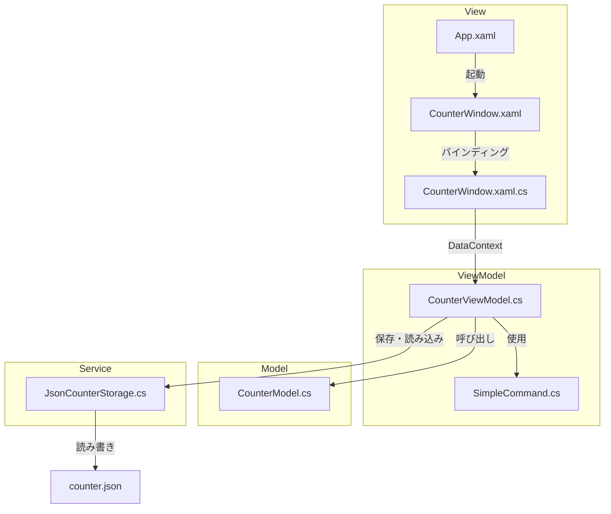

https://prota-p.com/csharp_wpf9_mvvm1/ を行った

# アーキテクチャ
- MVVM方式で実装している

```mermaid
graph TD
    subgraph View
        App.xaml
        CounterWindow.xaml
        CounterWindow.xaml.cs
    end
    subgraph ViewModel
        CounterViewModel.cs
        SimpleCommand.cs
    end
    subgraph Model
        CounterModel.cs
    end
    subgraph Service
        JsonCounterStorage.cs
    end

    App.xaml -->|起動| CounterWindow.xaml
    CounterWindow.xaml -->|バインディング| CounterWindow.xaml.cs
    CounterWindow.xaml.cs -->|DataContext| CounterViewModel.cs
    CounterViewModel.cs -->|使用| SimpleCommand.cs
    CounterViewModel.cs -->|呼び出し| CounterModel.cs
    CounterViewModel.cs -->|保存・読み込み| JsonCounterStorage.cs
    JsonCounterStorage.cs -->|読み書き| counter.json
```
