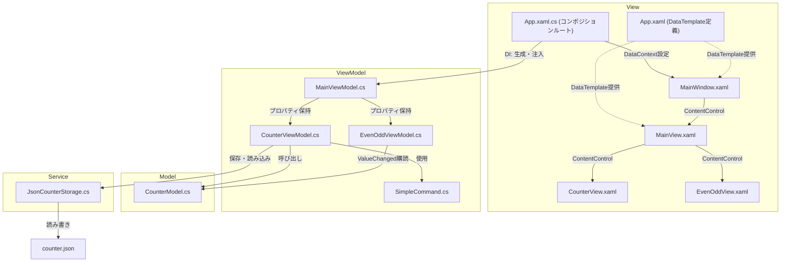

https://prota-p.com/csharp_wpf9_mvvm1/ を行った

# アーキテクチャ
- MVVM方式で実装している

# DI(依存性注入)について
- 依存性（クラスからnewした動くために必要なオブジェクト）を、外部から渡した
- 背景
  - 今までは、CounterViewModelでnewしていたクラスを、同じデータをEvenOddViewModelでも使いたくなった
  - そのまま２つのVMでnewするだけでは、値を共有できない
- 解決策
  - App.xaml.csでnewしたクラスを、２つのVMに渡す
  - こうすることで、それぞれのVMが同じクラスを見ているので、データを共有できる
- 言葉の説明
  - ２つのVMは、それぞれCounterModelがないと動かない（依存している）
  - その依存しているクラスを、外部(App.xaml.cs)から渡している（注入している）